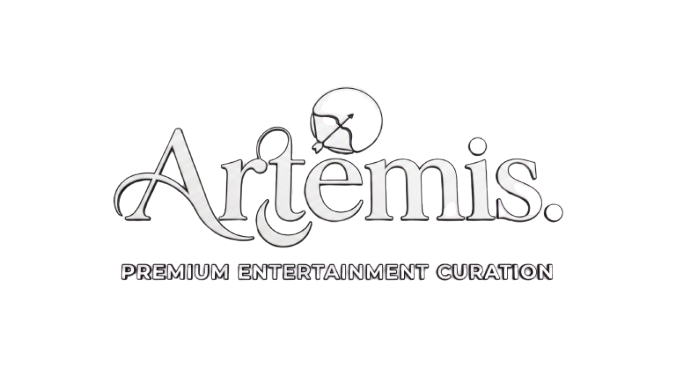

<div align="center">
  
  <p align="center">
    <br/>
    <strong>A premium, high-performance cinematic ticketing and seat reservation platform.</strong>
  </p>

  <p align="center">
    
    
    
    
    
  </p>

  <p align="center">
    <a href="#features">Features</a> •
    <a href="#tech-stack">Tech Stack</a> •
    <a href="#getting-started">Getting Started</a>
  </p>
</div>

---

## 📖 Overview

**Artemis** is a state-of-the-art web application designed for the modern moviegoer. It provides a sleek, high-performance, and deeply immersive interface for browsing movies, viewing cinematic details, and securely booking premium theater seats. 

Built with aesthetic excellence at its core, Artemis leverages a glassmorphism design language with subtle neon accents and micro-animations to create a luxurious user experience. The platform redefines digital ticketing with advanced authentication, interactive dashboards, intelligent search, and real-time movie trailers.

## ✨ Features

- **Premium Cinematic UI/UX**: A dark-mode first, highly polished glassmorphism interface featuring dynamic ribbed glass scanlines, glowing neon accents, and smooth Framer Motion micro-animations designed to awe users.
- **Dynamic Personalized Dashboard**: A deeply interactive user hub that greets users dynamically based on the time of day, tracks upcoming bookings, and provides personalized "For You" movie recommendations.
- **Rich Movie Metadata & Trailers**: Seamless integration with TMDB/IMDb for rich, accurate movie metadata and embedded high-quality YouTube trailers directly within the sleek movie details pane.
- **Secure Next-Gen Authentication**: Robust credential and OAuth login systems built on Better Auth, featuring flawless **One-Click Google Login** and secure session handling (with a fallback bypass mode for development).
- **Intelligent Search & Wishlisting**: A lightning-fast search tab for finding blockbusters and a one-click Wishlist system to save highly anticipated movies to your profile.
- **Mock Payment & Wallet System**: A frictionless, beautiful checkout flow supporting multiple saved credit cards and a built-in Artemis Wallet balance.
- **Interactive Promotions & Notifications**: A real-time dropdown system for managing unread alerts and easily copying dynamic promotional codes for discounts.
- **Seamless Database ORM**: Powered by Prisma and PostgreSQL for rapid data modeling and type-safe, high-speed backend queries.

## 📸 Gallery

<details>
<summary><b>Click to view UI Screenshots</b></summary>
<br/>

### 1. Welcome & Authentication

*The cinematic loading screen that welcomes users to Artemis.*


*Seamless authentication flow with secure credentials and OAuth integration.*

### 2. Personalized Onboarding
%20.png)
*Users select their favorite genres to build their taste profile.*

.png)
*Interactive swipe deck to fine-tune personalized movie recommendations.*

### 3. The Dashboard

*The central dashboard featuring dynamic greetings and curated movie lists.*

.png)
*Striking hero banner highlighting the latest blockbuster releases.*

.png)
*Movies beautifully categorized by major cinematic brands and studios.*


*Interactive dropdown for quick access to promotional codes and discounts.*

### 4. Discovery & Profile

*Lightning-fast search interface to explore the extensive movie catalog.*


*Dedicated tab to track and manage upcoming cinema visits.*

### 5. Movie Details

*Deep dive into movie metadata, synopsis, and immersive cinematic backgrounds.*


*Detailed cast profiles and critical reception ratings.*

### 6. Booking Experience
.png)
*Choosing the preferred language and viewing format (e.g., IMAX, 3D).*

.png)
*Selecting the most convenient cinema location and showtime.*

.png)
*Interactive, real-time seat map to reserve the perfect spot.*

.png)
*Clear breakdown of the order, including tickets, taxes, and applied promos.*

.png)
*Final confirmation screen with a beautiful digital ticket ready for the show.*

</details>

## 🛠 Tech Stack

This project is built using modern, enterprise-ready web technologies tailored for speed and reliability.

- **Framework**: [Next.js 15 (Turbopack)](https://nextjs.org/)
- **Frontend**: [React 18](https://react.dev/)
- **Styling**: [Tailwind CSS](https://tailwindcss.com/) with custom premium tokens and micro-animations
- **Icons**: [Lucide React](https://lucide.dev/)
- **Authentication**: [Better Auth](https://better-auth.com/)
- **Database ORM**: [Prisma](https://www.prisma.io/)
- **Database**: [PostgreSQL](https://www.postgresql.org/)

### Project Structure

```bash
├── prisma/             # SQLite schema & migrations
├── public/             # Static assets, logos, and images
├── src/
│   ├── app/            # Next.js App Router (Pages, API Routes, Layouts)
│   ├── components/     # Reusable React UI Components
│   └── lib/            # Utilities, Authentication Config, and Prisma Client
└── README.md           # You are here
```

## 🚀 Getting Started

Follow these steps to set up the project locally.

### Prerequisites

- Node.js 18+ 
- npm or pnpm

### Installation

1. **Clone the repository**
   ```bash
   git clone https://github.com/Shubham126710/Artemis.git
   cd Artemis
   ```

2. **Install dependencies**
   ```bash
   npm install
   ```

3. **Configure Environment Variables**
   Create a `.env` file in the root directory:
   ```env
   NEXT_PUBLIC_APP_URL="http://localhost:3000"
   BETTER_AUTH_SECRET="your_super_secret_auth_key"
   DATABASE_URL="file:./dev.db"
   
   # For Google OAuth
   GOOGLE_CLIENT_ID="your_google_client_id"
   GOOGLE_CLIENT_SECRET="your_google_client_secret"
   ```

4. **Initialize Database**
   Run Prisma migrations to build your schema and generate the client:
   ```bash
   npx prisma migrate dev
   npx prisma generate
   ```

5. **Run the Development Server**
   ```bash
   npm run dev
   ```

   Open [http://localhost:3000](http://localhost:3000) with your browser to launch Artemis.

## 📄 License

This project is licensed under the MIT License - see the LICENSE file for details.

---

<div align="center">
  <sub>Built with ❤️ by Shubham Upadhyay</sub>
</div>
